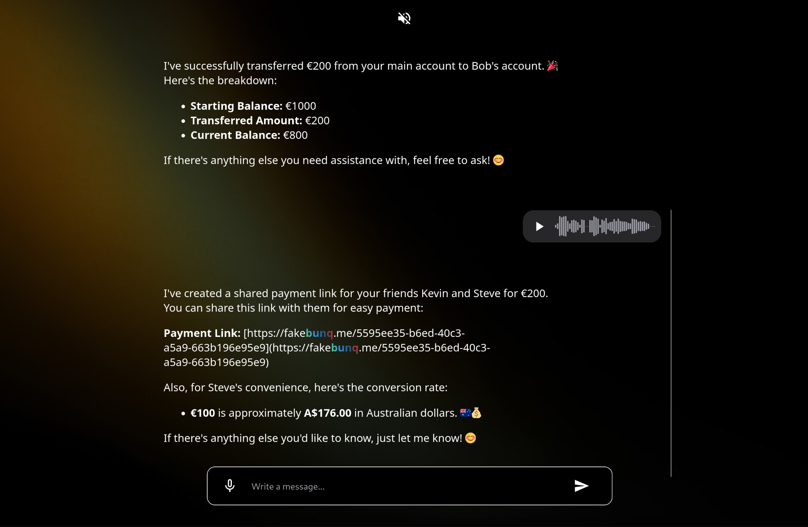

# Gideon – Voice-First Banking Assistant

**Say it. Boom. It’s done. Thanks, Gideon.**

Gideon is a voice-enabled banking assistant that makes managing money as easy as having a conversation. It features a React + TailwindCSS frontend and a Python backend with simulated banking and two AI agents (ChatGPT-4o and Gemini). The Gemini agent uses Google Cloud Speech for audio input/output.

---

## 🚀 Features

-   Voice-activated payments & account checks
-   Smart payment detection (IBAN, email, phone)
-   Real-time currency exchange
-   Dual AI: ChatGPT-4o & Gemini (with voice support)

## 🧪 Tech Stack

-   AI: ChatGPT-4o/Gemini

-   Backend: Flask, Python,OpenAi Agents SDK ,simulated bank APIs

-   Voice: Google Cloud Speech (transcription + audio output)/Whisper+OpenAi-tts

-   Frontend: React, TailwindCSS, Vercel

## 💬 Example Commands

-   “Send 20 euros to Alice for lunch”
-   “What’s my account balance?”
-   “Create a payment link for 10 euros – coffee”

.